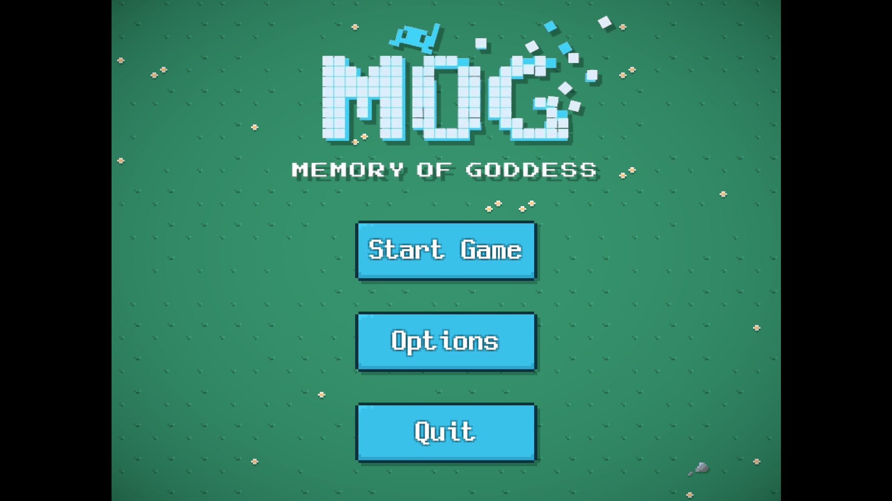
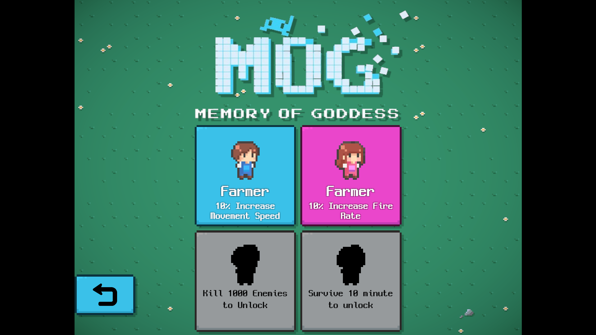
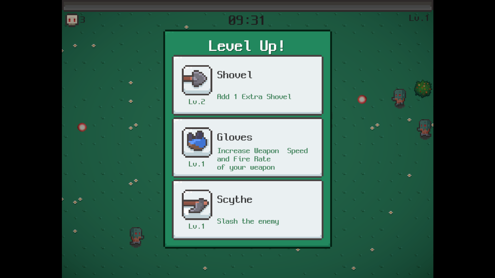
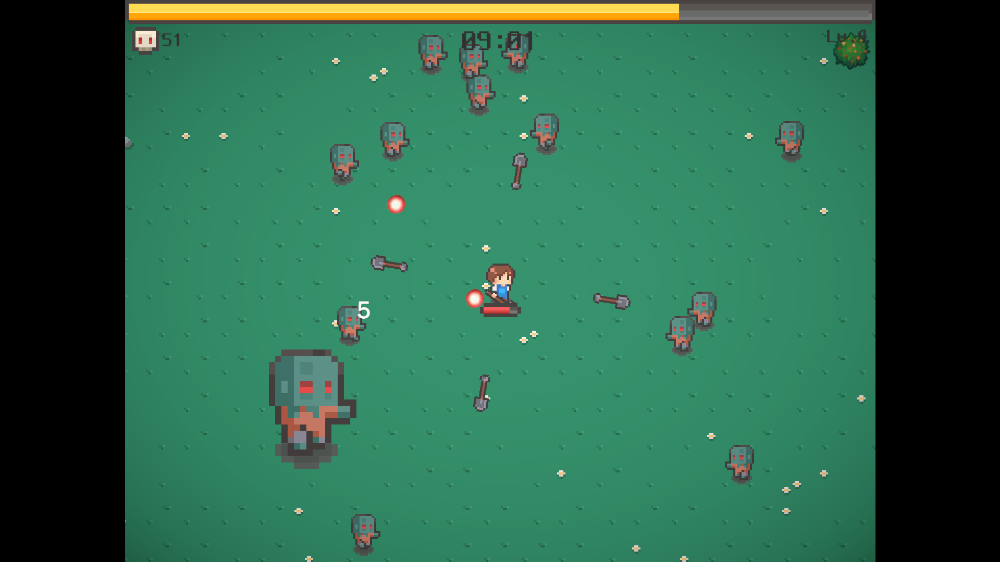
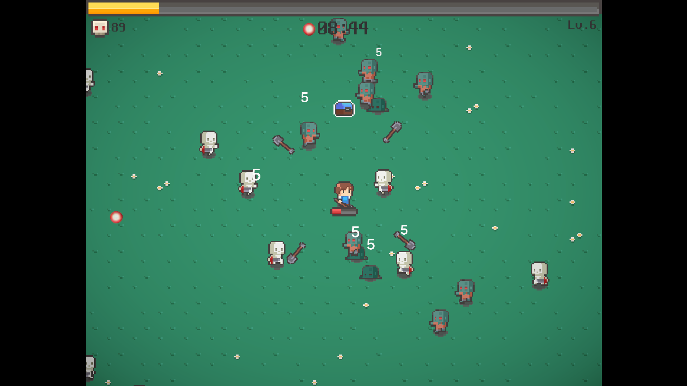
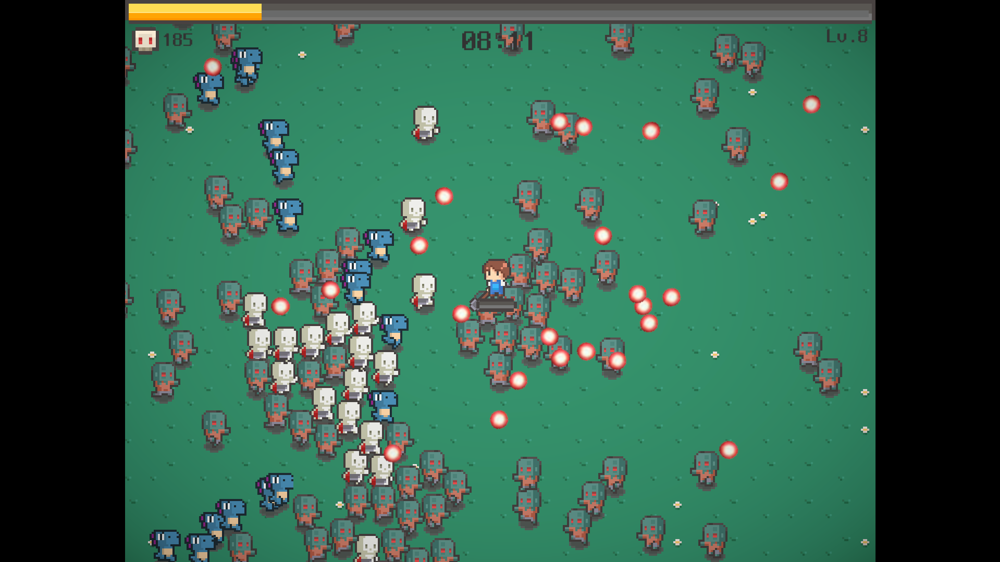
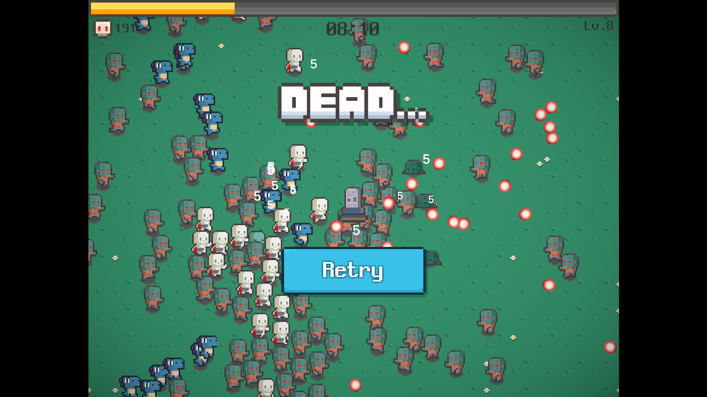

# Game Roguelike 2D
---
## Giới thiệu

**Game Roguelike 2D** là một trò chơi hành động phiêu lưu, nơi người chơi sẽ điều khiển nhân vật chiến đấu chống lại những kẻ thù và khám phá những môi trường độc đáo. Lấy cảm hứng từ trò chơi **Vampire Survivors**, trò chơi này kết hợp giữa yếu tố roguelike với lối chơi nhanh, mang đến những trải nghiệm đầy thách thức và hấp dẫn.
---
## Tính năng

- **Hệ thống chiến đấu đa dạng**: Người chơi có thể chọn từ nhiều loại nhân vật với khả năng và vũ khí khác nhau.
- **Khám phá môi trường**: Mỗi màn chơi được tạo ngẫu nhiên, mang đến trải nghiệm mới mẻ mỗi lần chơi.
- **Kẻ thù và boss độc đáo**: Gặp gỡ nhiều loại kẻ thù khác nhau với hành vi và chiến thuật riêng biệt.
- **Cải tiến và nâng cấp**: Thu thập điểm kinh nghiệm và nâng cấp nhân vật để trở nên mạnh mẽ hơn qua từng màn chơi.
- **Chế độ chơi phong phú**: Chơi một mình hoặc thử thách bạn bè trong chế độ nhiều người chơi.
---
## Cài đặt

### Yêu cầu hệ thống

- Hệ điều hành: Windows, macOS, hoặc Linux
- RAM: Tối thiểu 4GB
- Card đồ họa: Hỗ trợ OpenGL 2.0 trở lên
---
## Hướng dẫn chơi
- Sử dụng phím di chuyển để điều khiển nhân vật.
- Lựa chọn Passive phù hợp
- Thu thập tài nguyên và điểm kinh nghiệm từ các kẻ thù bị tiêu diệt.
- Đánh bại con trùm cuối hoặc sống sót tới bình minh
---
## Hình ẢNh Minh Họa 
  
  
  - **HUB:**
  
  
  - **Chọn Nhân Vật:**
  
  
  - **Vũ Khí:**
  
  
  - **Boss:**
  
  
  - **Phần thưởng cho mỗi con boss:**
  
  
  - **Số lượng áp đảo:**
  
  
 - **Dead:**
---
## Team

- **[Ngo Thai Nguyen](https://github.com/Cuteycate)** - Team Leader/Fullstack
- **[Nguyen Huy Truong](https://github.com/Truong5613)** - Fullstack
- **[Vo Trung Kien](https://github.com/KaeseyVNK)** - Fullstack
